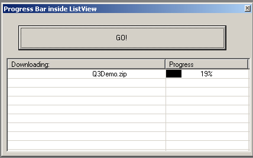



## Progress Bar in Listview

### Description

I started to make a Download manager and wanted a progress bar inside of a report list like napster. So here it is, the incomplete version. I guess i'll post a improved version with resizing the progress bar. And for some reason it adds a blank picture to the first item. i dunno so please help. -Special thanx to Eric
 
### More Info
 
I started to make a Download manager and wanted a progress bar inside of a report list like napster. So here it is, the incomplete version. I guess i'll post a improved version with resizing the progress bar. And for some reason it adds a blank picture to the first item. i dunno so please help.

             |
---                |---
**Submitted On**   |2000-07-16 00:14:26
**By**             |[Jarem Archer](https://github.com/Planet-Source-Code/PSCIndex/blob/master/ByAuthor/jarem-archer.md)
**Level**          |Intermediate
**User Rating**    |4.5 (36 globes from 8 users)
**Compatibility**  |VB 3\.0, VB 4\.0 \(16\-bit\), VB 4\.0 \(32\-bit\), VB 5\.0, VB 6\.0, VB Script, ASP \(Active Server Pages\) 
**Category**       |[Custom Controls/ Forms/  Menus](https://github.com/Planet-Source-Code/PSCIndex/blob/master/ByCategory/custom-controls-forms-menus__1-4.md)
**World**          |[Visual Basic](https://github.com/Planet-Source-Code/PSCIndex/blob/master/ByWorld/visual-basic.md)
**Archive File**   |[CODE\_UPLOAD78337162000\.zip](https://github.com/Planet-Source-Code/jarem-archer-progress-bar-in-listview__1-9805/archive/master.zip)

